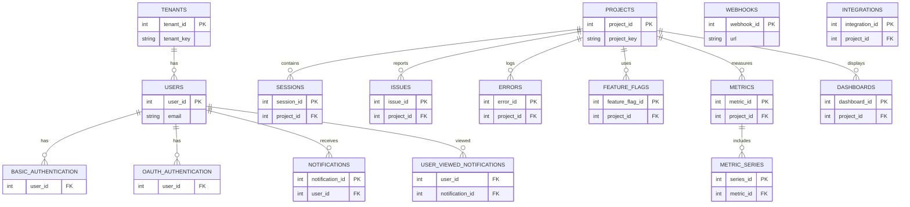

# Akera Openreplay guide:

## local Development

### option 1: using vagrant

it's better if you want to run the project in a virtual machine to avoid any conflict with your local environment.

1. Install [Vagrant](https://developer.hashicorp.com/vagrant/install) and [VirtualBox](https://www.virtualbox.org/wiki/Downloads)
2. clone the repo from akera github
3. run `vagrant up` in the root of the repo

### option 2: using [openreply_dev.sh](../openreplay_dev.sh) (can be heavy)

just run

```bash
curl -s https://raw.githubusercontent.com/Akera-Agency/openreplay-akera/main/openreplay_dev.sh | bash
```

you don't need to install anything or setup anything, just download and run the script in the root of your home (eg: `/home/aymane/`) and it will do everything for you.

- warning: this script will install docker and docker-compose and k8s if you don't have them already installed

### option 3: using openreplay local deployment script

you can use the [openreplay local deployment script](../scripts/helmcharts/local_deploy.sh) to deploy the project locally.

```bash
cd scripts/helmcharts
```

```bash
./local_deploy.sh all
```

## OpenAPI documentation for the API

- you can use this [link](https://stellar-muffin-df743e.netlify.app/#tag/reset-password/operation/reset_password_handler_password_reset_link_post) to see the API documentation online.

- you can also find the [open api json file here](./openapi/openapi.json) and use your favorite tool to visualize it. like [swagger editor](https://editor.swagger.io/) or [swagger-ui](https://swagger.io/tools/swagger-ui/)

- you can also use the static html file [here](./redoc-static.html) to visualize the openapi documentation.

## Database overview

- diagram of the database:



- the project uses [PostgreSQL](https://www.postgresql.org/) as a database, you can find the schema [here](../scripts/schema/db/init_dbs/postgresql/init_schema.sql)

- here is a simple explanation of the db (very simple):

### Schemas:

- `events_common`: This schema house tables that contain data commonly used across events.

- `events and events_ios`: These schemas focus on event-related data, the events_ios schema specifically for iOS-related events.

- `or_cache`: This schema might be dedicated to caching data for performance optimization.

### Functions:

- `generate_api_key`: Generates an API key, for application authentication.
- `notify_integration`: This trigger-based function that handles integration notifications,

### Core User Management:

- `public.tenants`: Manages tenant data with fields such as tenant_id and tenant_key.
- `public.users`: Stores user information, including user_id, email, and potentially other identifiers.
- `public.basic_authentication` and `public.oauth_authentication`: Authentication tables, with references to user_id from the users table.

### Project and Data Tracking:

- `public.projects`: Stores project-related data, identified by project_id and project_key.
- `public.sessions`: Tracks session data, with references to project_id.
- `public.issues` and `public.errors`: Hold records of issues and errors within projects, each with unique issue_id or error_id.

### Notifications and Integrations:

- `public.notifications`: Manages notifications with fields like notification_id and user_id.
- `public.integrations`: Manages project integrations, with foreign keys to projects.
- `public.webhooks`: Manages webhook entries with webhook_id for integrating with external services.

### Events and Actions:

- `events_common` and `events Schemas`: Include tables like customs, requests, clicks, errors, and performance that link to session data and capture various event types.
- `events_ios Schema`: Focused on iOS-specific event tracking with tables like views, taps, inputs, and swipes.

### Feature Management:

- `public.feature_flags` and `related tables`: Manage feature flags with conditions and variants, useful for feature toggling per project.
  Analytics and Dashboarding:

- `public.metrics` and `public.dashboards`: Store metric and dashboard information, allowing tracking and visualization within projects.
- `public.metric_series`: Associated with metrics to store time-series data.

## Services and their stack overview

the project is composed of multiple services, each service is a separate project with its own stack and dependencies.

here is a list of the services and their stack:

1. [assets](../backend/cmd/assets/main.go) (Golang) this service for caching assets and handling JavaScript exceptions, with proper logging, error handling, and graceful shutdown mechanisms.

2. [canvas-handler](../backend/cmd/canvas-handler/main.go) (Golang) this service for handling canvas images

3. [db](../backend/cmd/db/main.go) (Golang) this is a database service. It initializes various components such as PostgreSQL and Redis connections, managers for projects, sessions, and tags, a data saver, a message consumer, and a memory manager.

4. [ender](../backend/cmd/ender/main.go) (Golang) this service si for handling session endings

5. [heuristics](../backend/cmd/heuristics/main.go) (Golang) heuristics processing service that analyzes incoming messages to detect various issues and events.

6. [http](../backend/cmd/http/main.go) (Golang) a http service that handles this api [request](../backend/cmd/http/README.md)

7. [images storage](../backend/cmd/imagestorage/main.go) This is an image storage service in Go that handles screenshots for OpenReplay.

8. [integrations](../backend/cmd/integrations/main.go) (Golang) This is a integrations service in Go that handles integration with external services

9. [sink](../backend/cmd/sink/main.go) (Golang) This service in the one that handles message processing and storage.

10. [spot](../backend/cmd/spot/main.go) (Golang) a service in Go that serves as an HTTP server for OpenReplay's spot recording functionality

11. [storage](../backend/cmd/storage/main.go) (Golang) a service to Processes and stores session recordings/data to object storage (like S3), Handles both web and mobile session recordings
